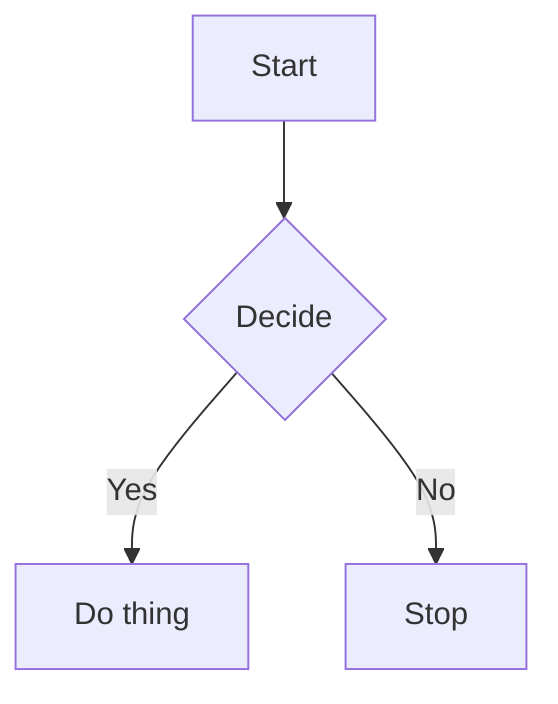
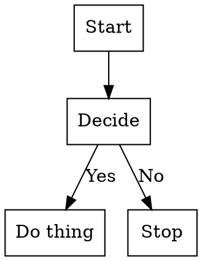
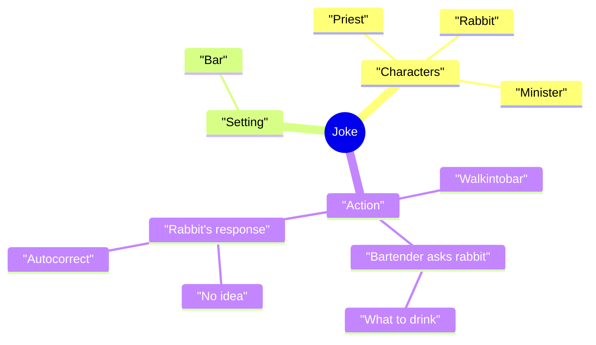

# MermaidJS::Grammar

Raku package with a grammar for Mermaid-JS diagram specs.

Languages and formats [Mermaid-JS](https://mermaid.js.org) is translated to:

- [X] DONE Raku
  - [X] DONE Flowcharts 
    - Translation to Raku hashmap structure with keys "nodes", "edges", and "styles".
  - [X] DONE Mind-maps
  - [ ] TODO Class diagrams
    - This can be very involved.
    - It is the inverse operation of the ones provided by ["UML::Translators"](https://raku.land/zef:antononcube/UML::Translators), [AAp1].
- [X] DONE JSON
  - Simple JSON serialization from Raku-actions results.
  - [X] DONE Flowcharts
  - [X] DONE Mind-maps
- [X] DONE [Graphviz DOT](https://graphviz.org/doc/info/lang.html)
- [ ] TODO [PlantUML](https://plantuml.com)
  - PlantUML uses DOT language, so, for flowcharts this _should be_ a very short and easy format implementation based on DOT actions.
  - The current unfinished implementation tries to reuse the Raku actions. (Without good results.)
- [ ] TODO Mathematica / Wolfram Language
  - [ ] TODO Flowcharts
    - [X] DONE Basic vertexes and edges
    - [ ] TODO Vertex styles
    - [ ] TODO Edge styles
  - [ ] TODO Mind-maps
    - In principle, it can be done from the Raku interpretations by ["Mathematica::Serializer"](https://raku.land/zef:antononcube/Mathematica::Serializer), [AAp2].
    - Maybe, it is better not to have the dependency, though. 

Currently, Only Mermaid-JS flowcharts are parsed and translated. 
Here is list of the parser implementation priorities (most important first):

- [X] DONE Flowcharts
- [ ] TODO Class diagrams
- [X] TODO Mind-maps
  - Much simpler to parse and interpret than class diagrams.
- [ ] TODO Sequence diagrams
- [ ] TODO ERD diagrams

A very similar Raku package is ["Graphviz::DOT::Grammar"](https://raku.land/zef:antononcube/Graphviz::DOT::Grammar), [AAp3].

------

## Installation

From [Zef ecosystem](https://raku.land):

```
zef install MermaidJS::Grammar
```

------

## Usage examples

### Flowcharts

Here is a Mermaid-JS spec:

```raku, output.prompt=NONE,  output.language=mermaid
my $spec = q:to/END/;
flowchart TD
  A[Start] --> B{Decide}
  B -->|Yes| C[Do thing]
  B -->|No| D[Stop]
END
```


Translate to Raku:

```raku
use MermaidJS::Grammar;
$spec ==> mermaid-js-interpret
```
```
# {edges => [{from => A, label => (Any), to => B, type => -->} {from => B, label => Yes, to => C, type => -->} {from => B, label => No, to => D, type => -->}], nodes => [{label => Start, name => A, type => rect} {label => Decide, name => B, type => rhombus} {label => Do thing, name => C, type => rect} {label => Stop, name => D, type => rect}], styles => [], type => flowchart}
```

Translate to [Graphviz DOT](https://graphviz.org):

```perl6, output.prompt=NONE,  output.language=dot
$spec ==> mermaid-js-interpret(a=>'DOT')
```


Translate to Mathematica / Wolfram Language [`Graph`](https://reference.wolfram.com/language/ref/Graph.html):

```perl6, output.prompt=NONE,  output.language=mathematica
$spec ==> mermaid-js-interpret(a=>'Mathematica')
```
```mathematica
Graph[{DirectedEdge["A", "B"], DirectedEdge["B", "C"], DirectedEdge["B", "D"]}, VertexLabels -> {"A" -> Placed["Start", Center], "B" -> Placed["Decide", Center], "C" -> Placed["Do thing", Center], "D" -> Placed["Stop", Center]}, VertexShapeFunction -> {"A" -> "Rectangle", "B" -> "Rectangle", "C" -> "Rectangle", "D" -> "Rectangle"}, EdgeLabels -> {DirectedEdge["B", "C"] -> "Yes", DirectedEdge["B", "D"] -> "No"}, VertexSize -> {"Scaled", 0.1}]
```

### Mind-maps

Here is Mermaid-JS mind-map spec:

```raku, output.prompt=NONE,  output.language=mermaid
my $spec = q:to/EOF/,
mindmap
    root((Joke))
        "Characters"
            "Priest"
            "Rabbit"
            "Minister"
        "Setting"
            "Bar"
        "Action"
            "Walkintobar"
            "Bartender asks rabbit"
                "What to drink"
            "Rabbit's response"
                "No idea"
                "Autocorrect"
EOF
```



Translate the mind-map into a Raku hashmap of hashmaps:

```raku
$spec ==> mermaid-js-interpret(a=>'Raku')
```
```
# {root => {Joke => {Action => {Bartender asks rabbit => {What to drink => {}}, Rabbit's response => {Autocorrect => {}, No idea => {}}, Walkintobar => {}}, Characters => {Minister => {}, Priest => {}, Rabbit => {}}, Setting => {Bar => {}}}}, type => mindmap}
```

------

## CLI

The package provides the Command Line Interface (CLI) script `from-mermaid-js`. Here is its usage message:

```shell
from-mermaid-js --help
```
```
# Usage:
#   from-mermaid-js <text> [-t|--to=<Str>] [-o|--output=<Str>] -- Converts Mermaid JS language texts or files into Graphviz DOT, JSON, Mathematica, PlantUML, or Raku files.
#   
#     <text>               Input file or Mermaid-JS spec.
#     -t|--to=<Str>        Format to convert to. (One of 'json', 'mathematica', 'dot', 'plantuml', 'raku', or 'Whatever'.) [default: 'Whatever']
#     -o|--output=<Str>    Output file; if an empty string then the result is printed to stdout. [default: '']
```

------

## References

[AAp1] Anton Antonov,
[UML::Translators. Raku package](https://github.com/antononcube/Raku-UML-Translators),
(2021-2024),
[GitHub/antononcube](https://github.com/antononcube).

[AAp2] Anton Antonov,
[Mathematica::Serializer. Raku package](https://github.com/antononcube/Raku-Mathematica-Serializer),
(2021-2022),
[GitHub/antononcube](https://github.com/antononcube).

[AAp2] Anton Antonov,
[Graphviz::DOT::Grammar. Raku package](https://github.com/antononcube/Raku-Graphviz-DOT-Grammar),
(2024),
[GitHub/antononcube](https://github.com/antononcube).